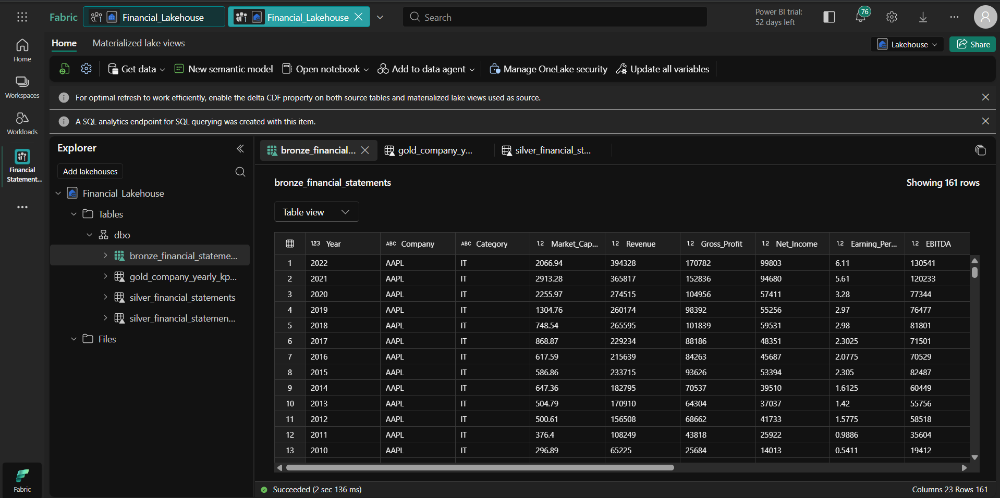
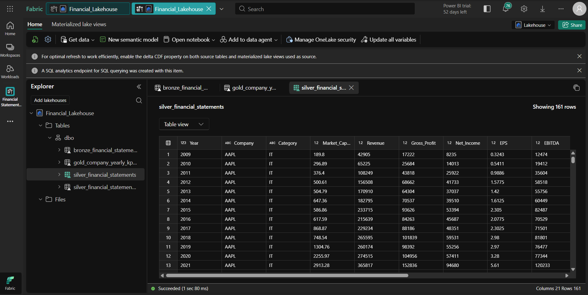
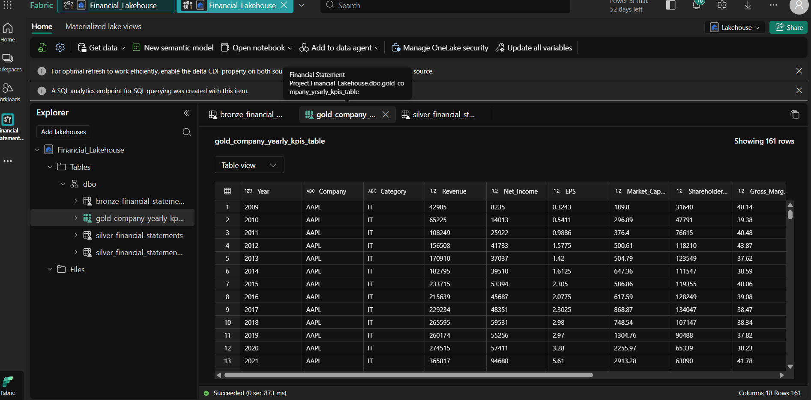
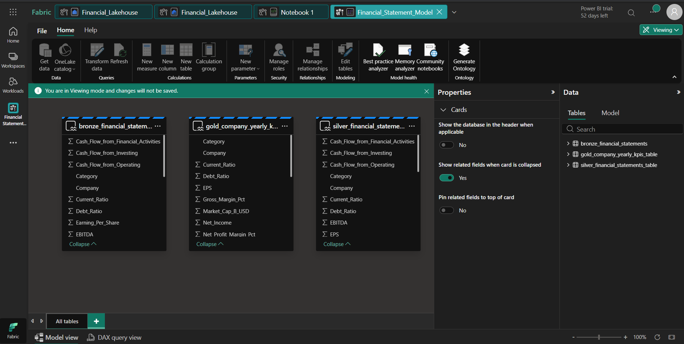
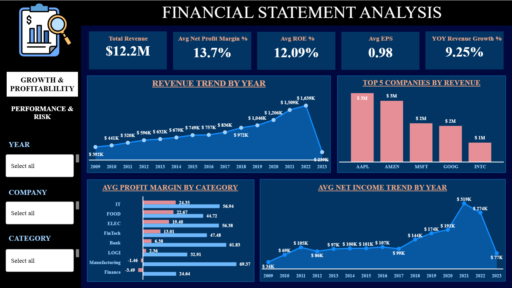
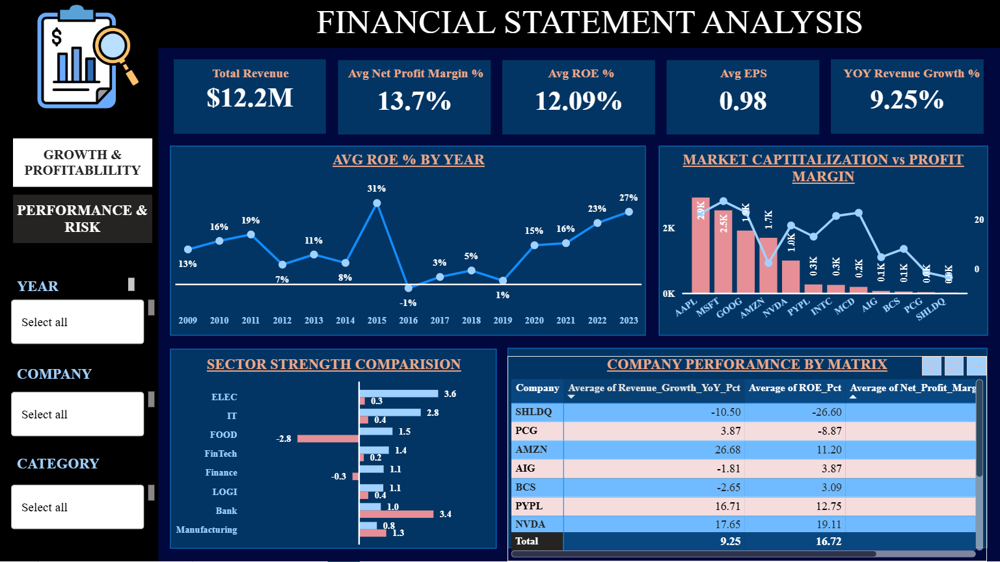

# Financial Statements Analysis Dashboard

**End-to-End Financial Analysis using Microsoft Fabric Lakehouse & Power BI**

Interactive dashboard built with Microsoft Fabric Lakehouse (Bronze → Silver → Gold), SQL, Notebooks, and Power BI to analyze financial performance of 12 major companies from 2009 to 2023.

---

## 📋 Project Overview

This project demonstrates a complete **Medallion Architecture** in Microsoft Fabric for financial data analysis. It includes data cleaning, KPI calculations, YoY growth analysis, and interactive dashboards to support investment decisions, growth tracking, profitability analysis, and risk assessment.

**Note**: This entire project was designed and developed by me from scratch.
---

## 🛠 Tech Stack

- **Microsoft Fabric** – Lakehouse, SQL Analytics Endpoint, Spark Notebooks  
- **SQL** – Data cleaning, transformations, and KPI calculations  
- **Power BI Desktop** – Live Connection, DAX measures, and interactive visualizations  

---

## 📁 Project Files
- [📊 Power BI Report](Financial%20Statement%20Analysis%20Power%20BI.pbix)
- [📓 Notebook](Financial_Statements_Silver_and_Gold_Tranformations_Notebook.ipynb) 
- [SQL Queries](Financial_Statement_SQL_Queries)
  
---

## 📸 Screenshots

**Bronze Layer**  

**Silver Layer**  

**Gold Layer**  

**Semantic Model**  

**Page 1 - Growth & Profitability** 

**Page 2 - Performance & Risk**  

## 📊 Key KPIs

- Total Revenue  
- Avg Net Profit Margin %  
- Avg ROE %  
- Avg EPS  
- Avg YoY Revenue Growth

---

## 🧠 Key Business Insights

**Page 1 – Growth & Profitability**  
- Tech companies (AAPL, MSFT, GOOG, NVDA) show strong consistent revenue and net income growth.  
- IT sector leads in profitability margins compared to Banking and Manufacturing.  
- Top revenue companies dominate the market, but faster-growing smaller firms offer emerging opportunities.

**Page 2 – Performance & Risk**  
- High ROE companies deliver better returns on equity – ideal for value investors.  
- Large market cap does not always mean high profitability; some big companies show efficiency issues.  
- Sectors with low Current Ratio and high Debt Ratio carry higher liquidity and leverage risk.  
- Companies with strong YoY growth + high ROE + healthy margins are the best overall performers for balanced portfolios.

These insights help in **investment selection**, **sector allocation**, and **risk management**.

---

## 📁 Architecture Summary

- **Bronze**: Raw CSV data  
- **Silver**: Cleaned data + calculated percentages (max 2 decimals)  
- **Gold**: Analytics table with YoY growth and KPIs  

---

## 💼 How to Explore

1. Download and open the `.pbix` file in Power BI Desktop.  
2. Use slicers (Year, Company, Category) to explore dynamically.  
3. Review Notebook and SQL queries for the full process.

---

⭐ Feel free to star the repository if you find it useful!

**Built with Microsoft Fabric Lakehouse + Power BI**
